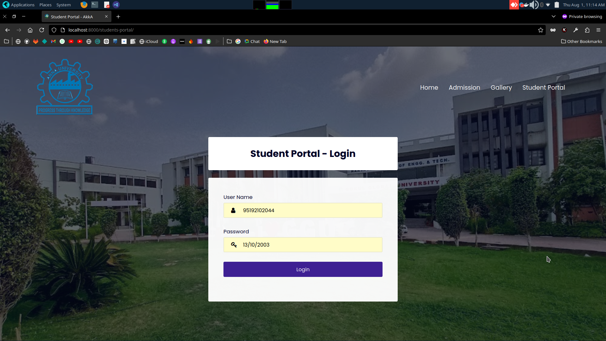
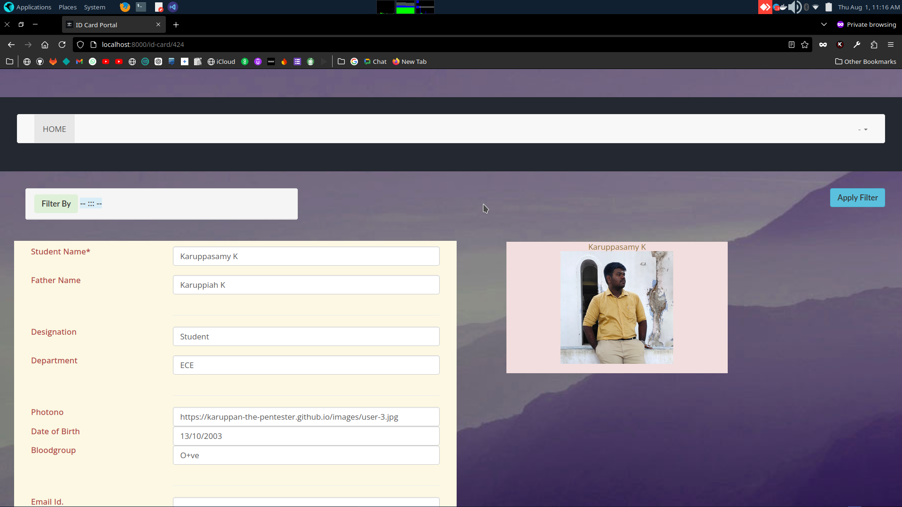
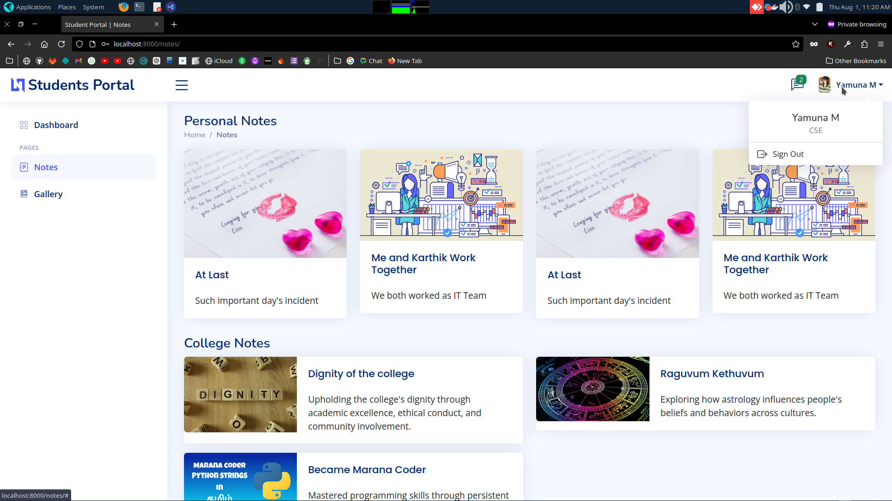
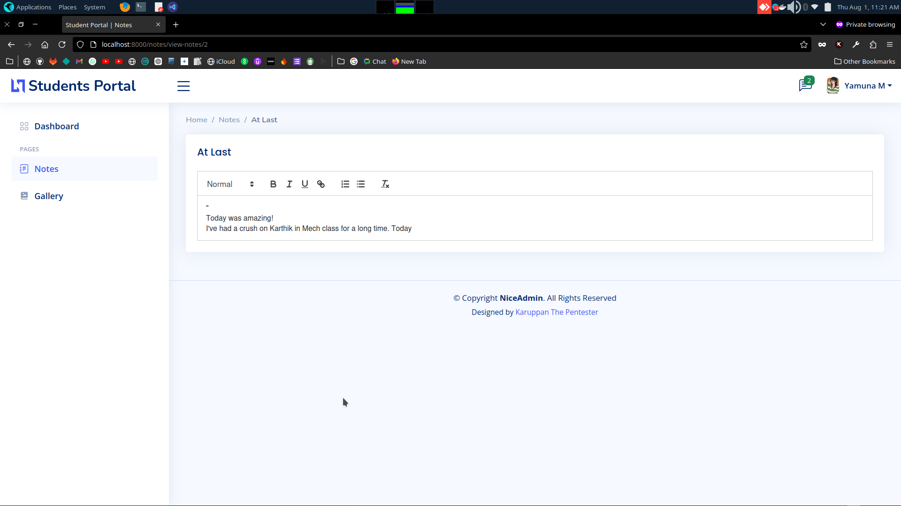

# FoundTheGurl

This CTF story is based on the College Students.
In a college, A tech person had the interest in a girl who is studying in the same campus but different department. Using his tech knowledge, he wants to impress her. At last he knows that she is already commited with another guy but he is not a good guy.
<br>

## Scenario 

You are the tech person 
And your credentials are username: 95192102044 | Password: 13/10/2003

<br>

## Vulnerabilities

<br><input type="checkbox" checked> Identify Your Gurl
<br><input type="checkbox" checked> Dumps Guy Code
<br><input type="checkbox" checked> Got The Culprit 
<br><input type="checkbox" checked> Safe Guarded the Girl


## Vulnerabilities

<br><input type="checkbox" checked> IDOR
<br><input type="checkbox" checked> Sensitive Data Exposure in the Git [OSINT]
<br><input type="checkbox" checked> Listing Private using access token
<br><input type="checkbox" checked> Broken Access Control


## Deployment

``` bash
docker compose build 
```

``` bash
docker compose up
```


## Write-Up

### 1] First We will login using the credential we got<br>


### 2] While Exploring I got notification that my ID card is ready<br>

### 3] I brute force the uri for the other user's data and i found my girl's profile<br>

### 4] I logged out from my session and login to my gir's profile using default credential<br>


### 5] I get to know that she is committed with another guy<br>


### 6] In next note I got the credentai of that guy.<br>
### 7] Using that credential I Logined his account <br>

### 8] I get to know that he is doing some illegal things and store in the git<br>
### 9] Using the git access token in his note, I can access the repository

### 10] I got the evidence but i need to sow to all users so I planned to use gallery option for that.<br>

### 11] see the gallery<br>
### 12] While uploading it have the status us default is pending<br>
### 13] I changed the thing to "Published" <br>
### 14] The culprit is exposed and the girl is safeguarded<br>

# ThankYou
Thanks for the oppurtunity 
